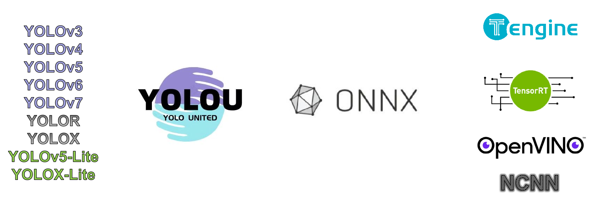

# YOLOU：United, Study and easier to Deploy

​	The purpose of our creation of YOLOU is to better learn the algorithms of the YOLO series and pay tribute to our predecessors.

​	Here "U" means United, mainly to gather more algorithms about the YOLO series through this project, so that friends can better learn the knowledge of object detection. At the same time, in order to better apply AI technology, YOLOU will also join The corresponding Deploy technology will accelerate the implementation of the algorithms we have learned and realize the value.



At present, the YOLO series algorithms mainly included in YOLOU are:

**Anchor-base**: YOLOv3, YOLOv4, YOLOv5, YOLOv5-Lite,  YOLOv7

**Anchor-Free**: YOLOv6, YOLOX, YOLOX-Lite

## Comparison of ablation experiment results

| Model      | size(pixels) |  mAP@.5   | mAP@.5:95 | Parameters(M) | GFLOPs | TensorRT-FP32(b16)<br>ms/fps | TensorRT-FP16(b16)<br/>ms/fps |
| :--------- | :----------: | :-------: | :-------: | :-----------: | :----: | :--------------------------: | :---------------------------: |
| YOLOv5n    |     640      |   45.7    |   28.0    |      1.9      |  4.5   |         0.95/1054.64         |         0.61/1631.64          |
| YOLOv5s    |     640      |   56.8    |   37.4    |      7.2      |  16.5  |          1.7/586.8           |         0.84/1186.42          |
| YOLOv5m    |     640      |   64.1    |   45.4    |     21.2      |  49.0  |         4.03/248.12          |          1.42/704.20          |
| YOLOv5l    |     640      |   67.3    |   49.0    |     46.5      | 109.1  |                              |                               |
| YOLOv5x    |     640      |   68.9    |   50.7    |     86.7      | 205.7  |                              |                               |
| YOLOv6-T   |     640      |           |           |               |        |                              |                               |
| YOLOv6-n   |     640      |           |           |               |        |                              |                               |
| YOLOv6     |     640      |   58.4    |   39.8    |     20.4      |  28.8  |         3.06/326.93          |          1.27/789.51          |
| YOLOv7     |     640      |   69.7    |   51.4    |     37.6      |  53.1  |         8.18/113.88          |          1.97/507.55          |
| YOLOv7-X   |     640      |   71.2    |   53.7    |     71.3      |  95.1  |                              |                               |
| YOLOv7-W6  |     640      |   72.6    |   54.9    |               |        |                              |                               |
| YOLOv7-E6  |     640      |   73.5    |   56.0    |               |        |                              |                               |
| YOLOv7-D6  |     640      |   74.0    |   56.6    |               |        |                              |                               |
| YOLOv7-E6E |     640      |   74.4    |   56.8    |               |        |                              |                               |
| YOLOX-s    |     640      |   59.0    |   39.2    |      8.1      |  10.8  |         2.11/473.78          |         0.89/1127.67          |
| YOLOX-m    |     640      |   63.8    |   44.5    |     23.3      |  31.2  |         4.94/202.43          |          1.58/632.48          |
| YOLOX-l    |     640      |           |           |     54.1      |  77.7  |                              |                               |
| YOLOX-x    |     640      |           |           |     104.5     | 156.2  |                              |                               |
| v5-Lite-e  |     320      |   35.1    |           |     0.78      |  0.73  |         0.55/1816.10         |         0.49/2048.47          |
| v5-Lite-s  |     416      |   42.0    |   25.2    |     1.64      |  1.66  |         0.72/1384.76         |         0.64/1567.36          |
| v5-Lite-c  |     512      |   50.9    |   32.5    |     4.57      |  5.92  |         1.18/850.03          |         0.80/1244.20          |
| v5-Lite-g  |     640      |   57.6    |   39.1    |     5.39      |  15.6  |         1.85/540.90          |          1.09/916.69          |
| X-Lite-e   |     320      |   36.4    |   21.2    |     2.53      |  1.58  |         0.65/1547.58         |         0.46/2156.38          |
| X-Lite-s   |     416      | Training… | Training… |     3.36      |  2.90  |                              |                               |
| X-Lite-c   |     512      | Training… | Training… |     6.25      |  5.92  |                              |                               |
| X-Lite-g   |     640      |   58.3    |   40.7    |     7.30      | 12.91  |         2.15/465.19          |          1.01/990.69          |

## How to use

### Install

```bash
git clone https://github.com/jizhishutong/YOLOU
cd YOLOU
pip install -r requirements.txt
```

### Training

```bash
python train.py --mode yolov6 --data coco.yaml --cfg yolov6.yaml --weights yolov6.pt --batch-size 32
```

### Detect

```bash
python detect.py --source 0  # webcam
                            file.jpg  # image 
                            file.mp4  # video
                            path/  # directory
                            path/*.jpg  # glob
                            'https://youtu.be/NUsoVlDFqZg'  # YouTube
                            'rtsp://example.com/media.mp4'  # RTSP, RTMP, HTTP stream
```

### DataSet

```bash
train: ../coco/images/train2017/
val: ../coco/images/val2017/
```

```bash
├── images            # xx.jpg example
│   ├── train2017        
│   │   ├── 000001.jpg
│   │   ├── 000002.jpg
│   │   └── 000003.jpg
│   └── val2017         
│       ├── 100001.jpg
│       ├── 100002.jpg
│       └── 100003.jpg
└── labels             # xx.txt example      
    ├── train2017       
    │   ├── 000001.txt
    │   ├── 000002.txt
    │   └── 000003.txt
    └── val2017         
        ├── 100001.txt
        ├── 100002.txt
        └── 100003.txt
```

### Export ONNX

```bash
python export.py --weights ./weights/yolov6/yolov6s.pt --include onnx
```

## Reference

https://github.com/ultralytics/yolov5

https://github.com/WongKinYiu/yolor

https://github.com/ppogg/YOLOv5-Lite

https://github.com/WongKinYiu/yolov7

https://github.com/meituan/YOLOv6

https://github.com/ultralytics/yolov3

https://github.com/Megvii-BaseDetection/YOLOX

https://github.com/WongKinYiu/ScaledYOLOv4

https://github.com/WongKinYiu/PyTorch_YOLOv4

https://github.com/WongKinYiu/yolor

https://github.com/shouxieai/tensorRT_Pro

https://github.com/Tencent/ncnn

https://github.com/Gumpest/YOLOv5-Multibackbone-Compression

https://github.com/positive666/yolov5_research

https://github.com/cmdbug/YOLOv5_NCNN

https://github.com/OAID/Tengine

## Citing YOLOU

If you use YOLOU in your research, please cite our work and give a star ⭐:

```
 @misc{yolou2022,
  title = { YOLOU：United, Study and easier to Deploy},
  author = {ChaucerG},
  year={2022}
}
```